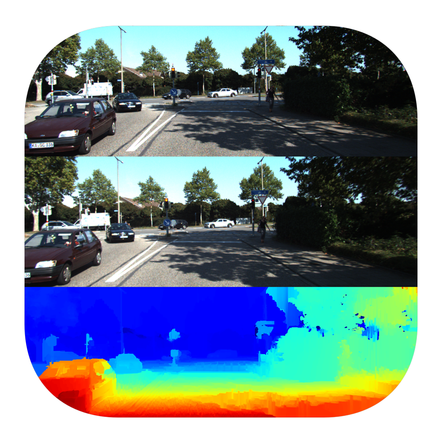
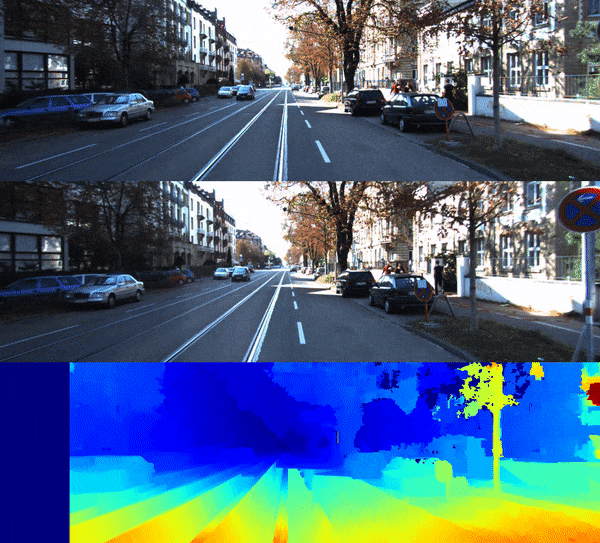
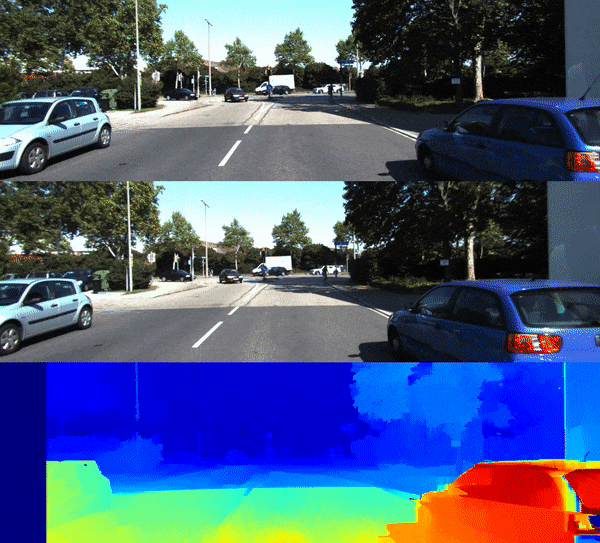

<h3 align="center">
  
</h3>

# Stereo Depth Estimator

## SGBM
**Semi-global block matching** - SGBM, by Hirschmuller, H. (2008). Stereo processing by semiglobal matching and mutual information. IEEE Transactions on pattern analysis and machine intelligence, 30(2), 328-341.

### Usage

`python3 stereo_depth_estimator_sgbm.py`

Required directory structure:

    .
    ├── ...
    ├── data                     
    │    ├── 1 (can be modified with DATASET constant)
    │        │──left (n left images)
    │        │──right (n right images)
    │        │──disparities (initially empty)
    │        │──combined (initially empty)

### Results

#### Dataset 1

#### Dataset 2

#### Dataset 3

## Author

**Greg (Grzegorz) Surma**

[**PORTFOLIO**](https://gsurma.github.io)

[**GITHUB**](https://github.com/gsurma)

[**BLOG**](https://medium.com/@gsurma)

